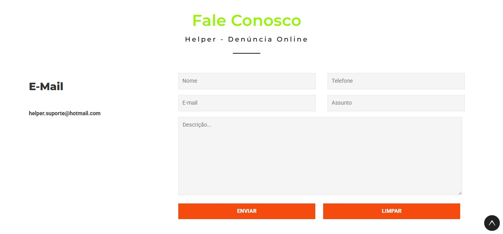
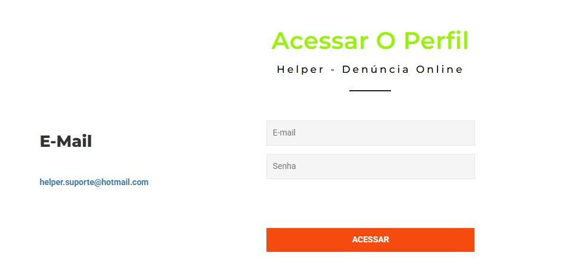
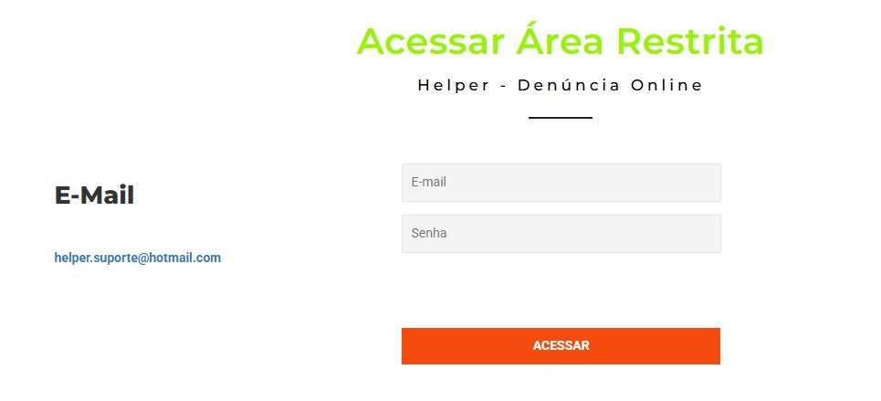

## ✨ Sobre

O **Helper** é um site produzido como Trabalho de Conclusão de Curso (TCC) do curso técnico em informática com enfâse em programação da ETEC Arnaldo Pereira Cheregatti, desenvolvido por mim, Ariel Vasconcelos. Ele é um site de denúncias online de crimes virtuais, que comtempla uma sistema de login para denunciantes e uma área restrita para quem recebe as denúncias. Foi realizado utilizando HTML, CSS, Bootstrap, PHP, Javascript e SQL. É importante ressaltar que o layout do frontend foi utilizado um modelo da [W3Layouts](https://w3layouts.com/), porém o backend foi totalmente desenvolvido por mim.

## 🚀 Componentes

Atualmente, o projeto inclui:

### Página Inicial

### Cadastro

### Suporte

### Perfil

### Área Restrita

